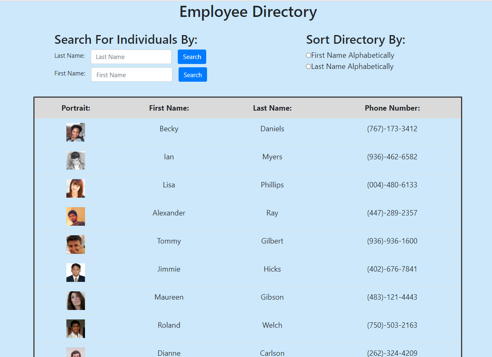
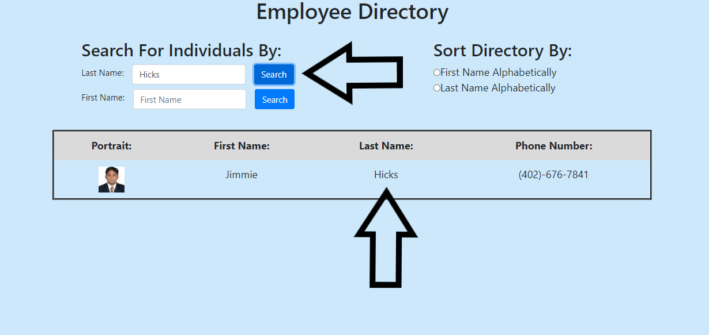
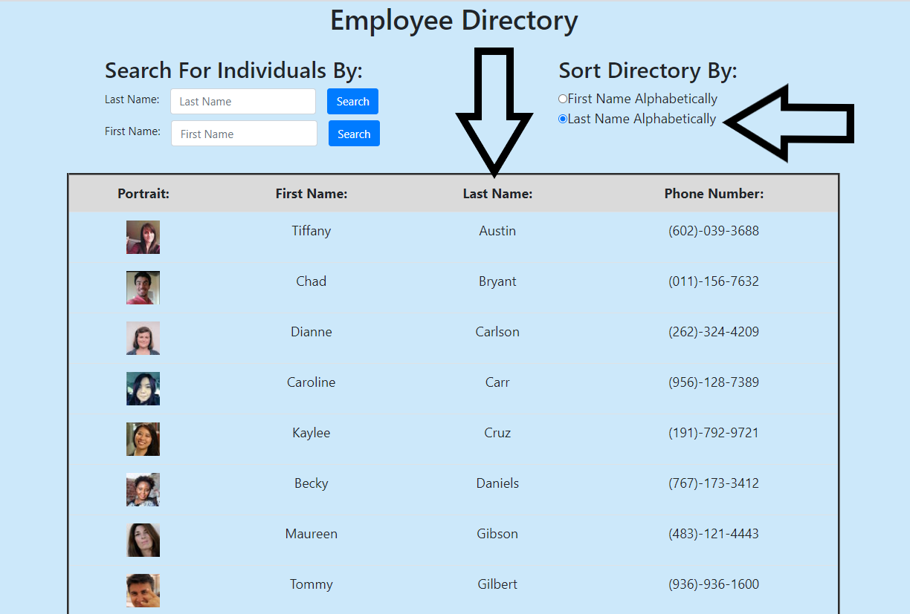

# React Employee Directory

## Overview:
This app uses React to make a searchable/sortable employee directory.  The app currently is generating a random list of 20 people by calling the random user generator API (https://randomuser.me/) and rendering a functional employee directory with the response given by the API.  This was primarily accomplished with React, functional and class components, and the random user API.  

### Table of Contents:
1. [How it works](#How-it-works)
2. [Example](#Example)
3. [Installation](#Installation)
4. [Contributing](#Contributing)
5. [Questions](#Questions)
6. [License](#License)

### How it works!
To use the app simply launch the page and you will immedietly see an employee directory.  If you would like to sort the directory alphabetically either by first or last name click on one of the radio buttons at the top of the page.  Also if you would like to search for a particular person in the directory enter either their first or last name in the search box at the top of the page.

Open Page:      Search for Employee:      Filter Directory:      

### Example
Here is a link to the React Employee Directory:  [https://vfavorito.github.io/react-employee-directory/](https://vfavorito.github.io/react-employee-directory/)

### Installation
To work with this app on your local machine node will be required and then run npm i to install package files.

### Contributing
If you would like to contribute to the development of this app the guidelines for doing so can be found here: [Contribution Covenant](https://www.contributor-covenant.org/version/2/0/code_of_conduct/code_of_conduct.txt)

### Questions?
Visit my Github profile here: [vfavorito](https://github.com/vfavorito) 
If you have any questions you can reach out to me at vince.favorito@gmail.com

### License
This App is covered under the MIT License